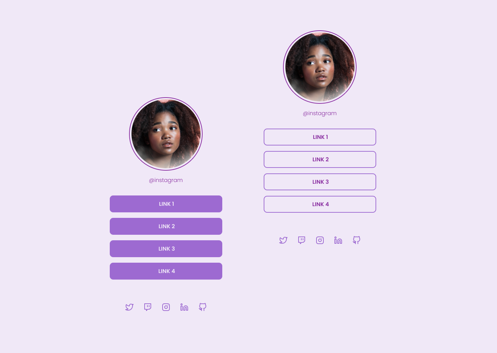

# Social Tree

## [Click aqui para visitar a página do projeto!]()

  

## 💻 Projeto

Este projeto é uma página com uma lista de links que poderá ser usada em perfis de redes sociais, onde o usuário pode divulgar suas redes sociais.
O projeto é um desafio desenvolvido pela Rocketseat na Trilha Discover.

[Rocketseat](https://www.rocketseat.com.br/)

## 🚀 Tecnologias

Esse projeto foi desenvolvido com as seguintes tecnologias:

- HTML
- CSS

Bibliotecas:

- [Google Fonts](https://fonts.google.com/)
